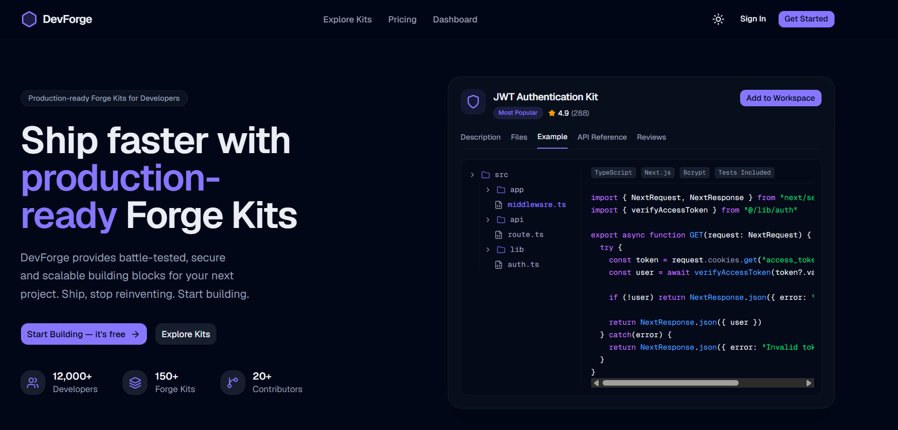
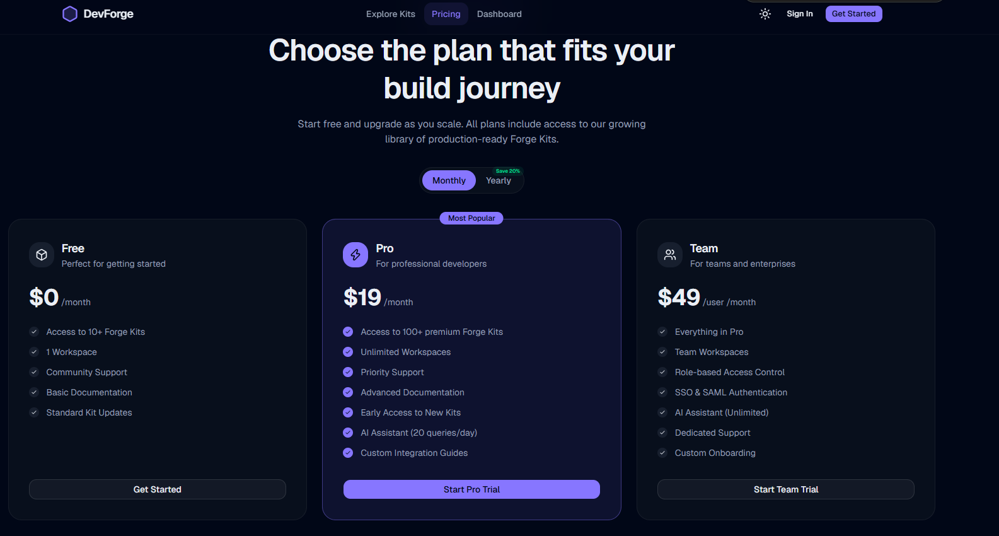
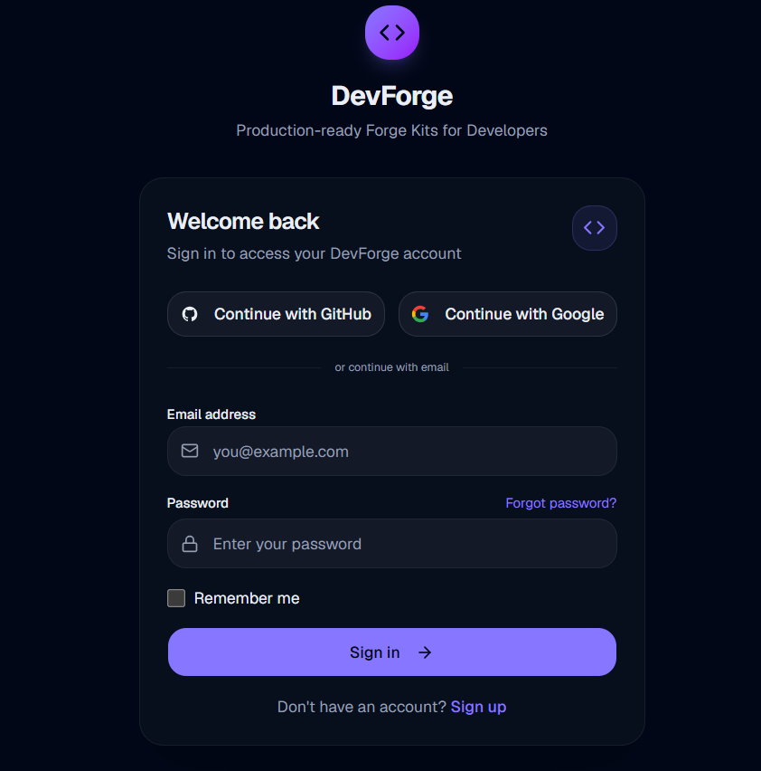
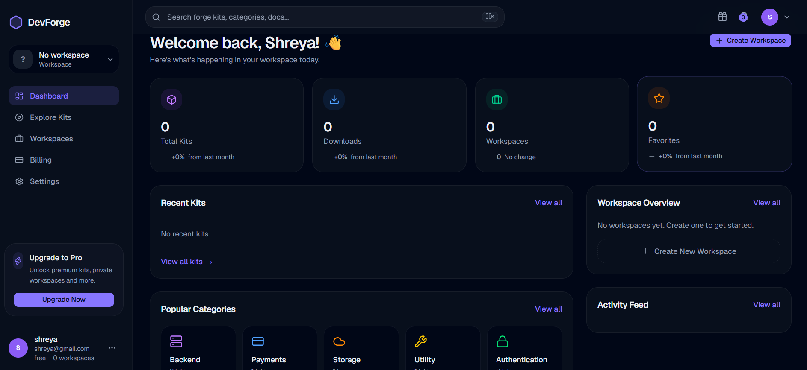
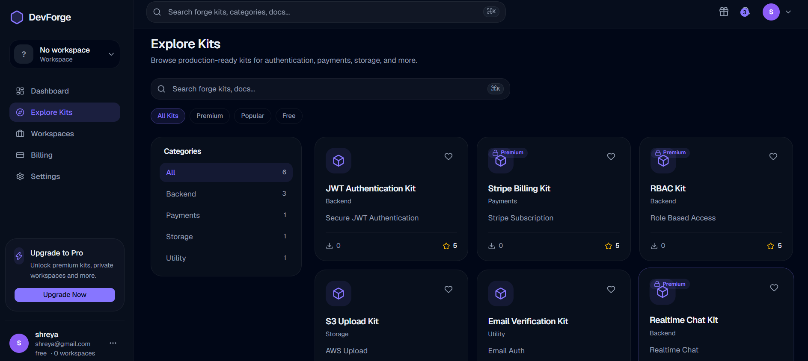

# 🚀 DevForge

> Production-ready Forge Kits for developers. Stop reinventing the wheel and ship faster.



---

## ✨ Overview

DevForge is a SaaS marketplace for production-ready backend kits.

Instead of building authentication, payments, RBAC, storage, email verification, and other backend modules from scratch, developers can browse, preview, and add ready-made Forge Kits into their workspace.

Built for the **American Express x CodeStreet Hackathon**.

---

# ✨ Features

- 🔐 Secure Authentication (Supabase Auth)
- 📦 Browse Production-ready Forge Kits
- ❤️ Favorite Kits
- 🗂 Workspace Management
- 💳 Subscription & Billing
- 👤 User Dashboard
- 🔍 Search & Category Filters
- ⭐ Premium Kit Gating
- ☁ Supabase Database
- ⚡ Next.js App Router
- 🌙 Modern Dark UI

---

# 🖥 Screenshots

## Landing Page


---

## Explore Kits



---

## Dashboard



---

## Billing



---

## Mobile Responsive



---

# 🏗 Tech Stack

## Frontend

- Next.js 16
- React
- TypeScript
- Tailwind CSS
- shadcn/ui
- Lucide Icons

## Backend

- Next.js API Routes
- Supabase
- PostgreSQL

## Authentication

- Supabase Auth

## Database

- PostgreSQL
- Row Level Security (RLS)

## Deployment

- Vercel

---

# 📂 Project Structure

```text
src/
│
├── app/
│   ├── dashboard/
│   ├── explore/
│   ├── billing/
│   ├── pricing/
│   ├── signin/
│   ├── signup/
│   └── kits/
│
├── components/
│
├── lib/
│   ├── supabase/
│   ├── services/
│   └── utils/
│
├── hooks/
│
└── types/
```

---

# 🛠 Installation

Clone the repository

```bash
git clone https://github.com/shreyad2806/DevForge.git
```

Install dependencies

```bash
npm install
```

Create environment variables

```env
NEXT_PUBLIC_SUPABASE_URL=

NEXT_PUBLIC_SUPABASE_ANON_KEY=

SUPABASE_SERVICE_ROLE_KEY=

NEXT_PUBLIC_APP_URL=http://localhost:3000

POLAR_SERVER=sandbox

POLAR_ACCESS_TOKEN=

POLAR_PRODUCT_ID=

POLAR_WEBHOOK_SECRET=
```

Run locally

```bash
npm run dev
```

---

# 🗄 Database

Supabase powers

- Authentication
- User Profiles
- Forge Kits
- Favorites
- Workspaces
- Billing
- Subscriptions

---

# 🔒 Authentication

- Email & Password
- Protected Dashboard
- Protected Routes
- Session Persistence
- Middleware Authorization

---

# 💎 Premium Features

Premium Forge Kits include

- Stripe Billing Kit
- RBAC Authorization Kit
- Realtime Chat Kit

Free users

- Preview kits
- Browse documentation
- Cannot access premium downloads

---

# 📈 Future Improvements

- AI-powered Kit Recommendation
- Semantic Search
- AI Code Assistant
- One-click Repository Generation
- GitHub Integration
- Team Collaboration
- Marketplace for Community Forge Kits

---

# 👨‍💻 Author

**Shreya Dubey**

GitHub

https://github.com/shreyad2806

LinkedIn

https://linkedin.com/in/shreya-dubey-544874289

---

# ⭐ Support

If you like the project, consider giving it a ⭐ on GitHub.